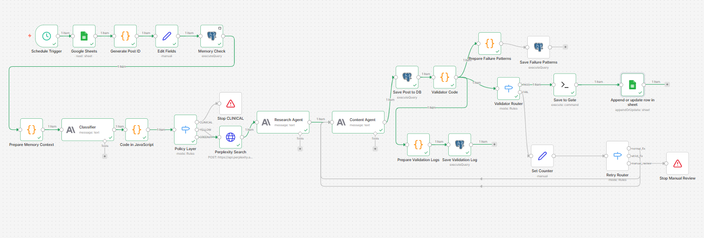

# AI Content Orchestrator

A governed AI workflow designed for sensitive content generation.

The system separates:
- research
- generation
- policy
- validation
- human approval

to reduce:
- semantic drift
- unsafe outputs
- uncontrolled automation
- prompt instability

Instead of optimizing for full autonomy,  
the architecture prioritizes:
- governance
- observability
- deterministic validation
- human oversight

---

## Core Principle

> AI proposes. Human decides.

A prompt asks. Code enforces.

Every hard rule lives in deterministic code — not in prompts.  
The system cannot override them.

Human approval is mandatory and hardcoded into the workflow.

---

## Why This Exists

Large language models are good at generating text,  
but unreliable at:
- guarantees
- constraints
- consistency
- long-term behavioral stability

Most AI workflows optimize for generation speed.

This project explores a different question:

> Can AI systems complete complex tasks reliably while remaining observable, constrained, and under human control?

The domain is intentional: psychology and neuroscience.

It is a useful stress-test environment because the system cannot simply generate content. It must:
- classify sensitive topics
- verify research quality
- avoid clinical escalation
- follow strict safety policies
- preserve semantic relevance
- remain reviewable by humans

---

## Architecture

### High-Level Pipeline

Topic Selection  
→ Safety Classification  
→ Research & Source Verification  
→ Policy Enforcement  
→ Content Generation  
→ Deterministic Validation  
→ Human Gate  
→ Publish

---

## Governance Model

The architecture separates:
- generation
- policy
- validation
- execution

instead of relying on prompts alone.

### Key principles

- Safety-critical logic is deterministic
- Human oversight is mandatory
- Validators operate independently from generators
- Retry systems are constrained
- Observability is prioritized over autonomy
- Governance exists outside prompts

---

## Current Capabilities

- Deterministic policy enforcement outside prompts
- Multi-stage validation with retry governance
- Human-in-the-loop approval workflow
- Topic risk classification (GREEN / YELLOW / RED)
- Structured audit logging
- Failure-aware memory layer
- Real-time observability metrics
- Threshold-based health monitoring
- Prompt and workflow versioning
- Source verification and filtering
- Semantic drift monitoring

---

## Real Operational Problems Observed

The project documents real-world AI workflow failure modes, including:
- semantic drift from prompt examples
- retry degradation
- memory pressure effects
- validator false positives / false negatives
- topic contamination through few-shot examples
- instability caused by prompt complexity

The goal is not to hide these behaviors,  
but to make them observable and governable.

---

## Stack

- Orchestration: n8n (self-hosted)
- AI: Claude Haiku + Sonnet
- Search: Perplexity API
- Database: PostgreSQL
- Infrastructure: Hetzner VPS (EU)

---

## Current Status

Active development — Day 40.

The system is running in production-like testing with:
- published Instagram posts
- structured human review
- retry governance
- observability instrumentation
- audit logging
- memory-aware generation

Current focus:
- semantic validation
- governance reliability
- observability
- long-term maintainability

---

## Design Philosophy

> Don’t make the system smarter.  
> Make it more observable and controllable.

This project is intentionally designed as a controlled AI system — not an autonomous AI system.

---

Natalia Chernenkaya  
Prague · 2026

## Architecture

